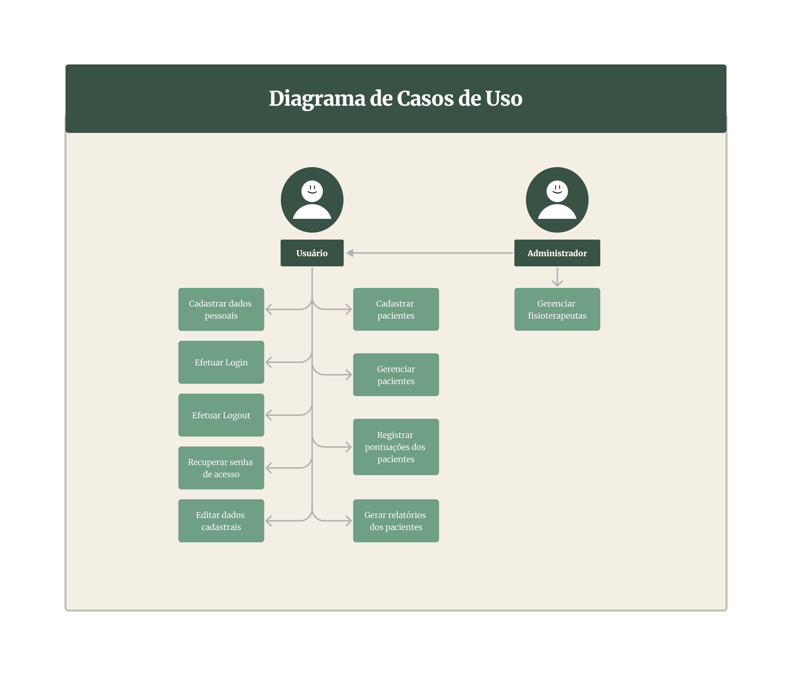

# Especificações do Projeto

Pré-requisitos: <a href="1-Documentação de Contexto.md"> Documentação de Contexto</a>

Definição do problema e ideia de solução a partir da perspectiva do usuário. É composta pela definição do diagrama de personas, histórias de usuários, requisitos funcionais e não funcionais além das restrições do projeto.

Apresente uma visão geral do que será abordado nesta parte do documento, enumerando as técnicas e/ou ferramentas utilizadas para realizar a especificações do projeto

## Arquitetura e Tecnologias

o A arquitetura levantada para atender os requisitos funcionais e não funcionais, foi definida conforme o seguinte diagrama:

Serão utilizadas as tecnologias:
- ReactJs: para integrar os serviços e desenvolver a interface do usuário;
- OAuth: para a autenticação dos usuários;

## Project Model Canvas

## Personas

As personas levantadas durante o processo de entendimento do problema, realização de entrevistas e análises dos dados são apresentadas na figuras a seguir:

## Requisitos

As tabelas que se seguem apresentam os requisitos funcionais e não funcionais que detalham o escopo do projeto. Em sua elaboração foi aplicada a técnica de Priorização por Matriz de Impacto e Urgência: Os requisitos são avaliados com base em seu impacto (alta, média, baixa) e urgência (alta, média, baixa). Requisitos com alto impacto e alta urgência recebem prioridade mais alta.

### Requisitos Funcionais

| ID     | Descrição do Requisito                                                                                                                                  | Prioridade |
| ------ | ------------------------------------------------------------------------------------------------------------------------------------------------------- | ---------- |
| RF-001 | Permitir que novos usuários se cadastrem, coletando informações pessoais necessárias para criação de uma conta na aplicação                             | ALTA       |
| RF-002 | Permitir que os usuários acessem suas contas, fornecendo suas credenciais de autenticação, como nome de usuário e senha                                 | ALTA       |
| RF-003 | O sistema deve oferecer uma funcionalidade de recuperação de senha                                                                                      | ALTA       |
| RF-004 | Possibilitar o cadastro de pacientes fornecendo um identificador único para cada um                                                                     | ALTA       |
| RF-005 | Permitir que fisioterapeutas registrem pontuações específicas dos pacientes seguindo a Escala PERME                                                     | ALTA       |
| RF-006 | Possibilitar que vários fisioterapeutas acessem o aplicativo e registrem avaliações de pacientes                                                        | MÉDIA      |
| RF-007 | Adaptar o aplicativo para funcionar em dispositivos móveis, bem como em computadores                                                                    | ALTA       |
| RF-008 | O sistema deve permitir a geração de relatórios em formato PDF que apresentem a evolução dos pacientes ao longo do tempo com base nos dados armazenados | MÉDIA      |
| RF-009 | Permitir que administradores adicionem, modifiquem ou removam contas de fisioterapeutas                                                                 | MÉDIA      |
| RF-010 | Deve haver diferentes níveis de permissões de acesso, com base nas responsabilidades dos usuários                                                       | MÉDIA      |

### Requisitos não Funcionais

| ID      | Descrição do Requisito                                                                           | Prioridade |
| ------- | ------------------------------------------------------------------------------------------------ | ---------- |
| RNF-001 | O aplicativo deve estar disponível 24 horas por dia, 7 dias por semana                           | ALTA       |
| RNF-002 | O aplicativo deve usar autenticação de usuário, criptografia de dados e controle de acesso       | ALTA       |
| RNF-003 | Deve ser compatível com diferentes navegadores da web, sistemas operacionais e dispositivos      | MÉDIA      |
| RNF-004 | Deve ser compatível com diferentes navegadores da web, sistemas operacionais e dispositivos      | MÉDIA      |
| RNF-005 | A interface do aplicativo deve ser intuitiva e fácil de usar                                     | MÉDIA      |
| RNF-006 | O aplicativo deve estar em conformidade com a Lei Geral de Proteção de Dados (LGPD)              | ALTA       |
| RNF-007 | Deve ser fornecida documentação detalhada, como manual de usuário e guia de solução de problemas | MÉDIA      |

Com base nas Histórias de Usuário, enumere os requisitos da sua solução. Classifique esses requisitos em dois grupos:

## Restrições

O projeto está restrito pelos itens apresentados na tabela a seguir.

| ID  | Restrição                                                                                                                                       |
| --- | ----------------------------------------------------------------------------------------------------------------------------------------------- |
| 01  | A aplicação deve ser implementada sem uso de recursos financeiros do hospital                                                                   |
| 02  | Desenvolvimento e implementação da aplicação em 3 meses                                                                                         |
| 03  | A aplicação deve ser projetada para funcionar eficientemente em infraestruturas de hardware existentes no hospital                              |
| 04  | A aplicação será desenvolvida em conformidade com os rigorosos padrões de qualidade e segurança em saúde estabelecidos pelos órgãos reguladores |
| 05  | A disponibilidade de dados e funcionalidades da aplicação dependerá da conectividade com a internet                                             |

## Diagrama de Casos de Uso

## Modelo ER e Projeto de Base de Dados

