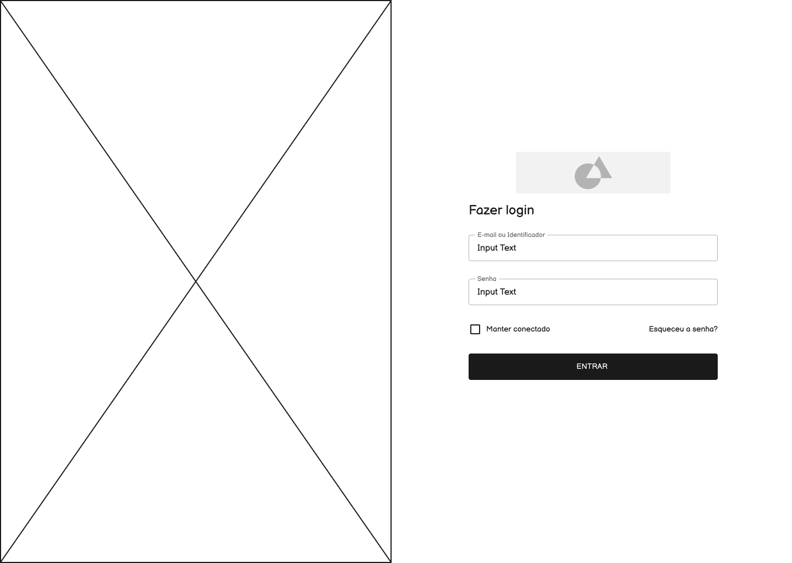

# Projeto de Interface

Pré-requisitos: <a href="2-Especificação do Projeto.md"> Documentação de Especificação</a>

Visão geral da interação do usuário com as funcionalidades que fazem parte do sistema sociotécnico (protótipo de telas).

## Wireframes

Foram desenvolvidos wireframes na ferramenta Figma, para ajudar na definição da estrutura das solução web para facilitar o entendimento da relação entre as possíveis telas existentes no sistema. A seguir os wireframes de todas as telas do sistema.

### RF-001 - Tela de Cadastro

A tela de cadastro é uma tela criada para o usuário que deseja utilizar a plataforma e salvar as criações feitas no seu planner. Nela é oferecido um formulário em que o usuário preenche suas informações pessoais e cria as credenciais de acesso ao sistema.

### RF-002 - Tela de Login

Quando o usuário acessa o website e não está logado na plataforma, na barra de navegação, no topo da página, haverá um botão de acesso rápido ao login do sistema. A tela contém inputs em que o usuário deverá digitar suas credenciais de acesso. Há um botão para cadastro, no caso de o usuário ainda não ser cadastrado e um botão para recuperação da senha, se o usuário a tiver esquecido. No caso do mobile, assim que o usuário já cadastrado acessar o aplicativo será redirecionado diretamente à tela de login.

### RF-003 - Telas de Recuperação de senha

Caso o usuário esqueça sua senha ele pode acessar a tela de recuperação de senha onde haverá um formulário para preenchimento do email e recebimento de um link para
recuperação de senha. Ao clicar nesse link o usuário será redirecionado para a tela onde ele poderá cadastrar uma nova senha.

### RF-004, RF-005, RF-006 e RF-008 - Telas de Cadastro de pacientes e formulário da Escala PERME, Pacientes e dashboard do paciente

Nestas tela de pacientes o usuário fisioterapeuta irá visualizar os pacientes cadastrados por meios de cards. Na tela paciente, há um botão "Novo paciente" onde, ao clicar, o usuário será redirecionado ao cadastro dos pacientes e realizará o levantamento dos dados necessários utilizando o formulário da Escala PERME. Os cards contam com um botão de "Nova aferição" para assim realizar um novo levantamendo de dados com formulário da Escala PERME. Há um outro botão, o de "Gerenciar" onde, ao clicar, o fisioterapeuta irá ser redirecionado a tela de dashboard do paciente. Onde será possível visualizar todo o histórico de formulários do paciente e o seu gráfico de evolução. Nestá tela o usuário também conta com o botão de "Nova aferição", um botão para exportar os dados e um botão de dar a "Alta da ala da fisioterapia".

### RF-008 - Telas de Dashboard do administrador

Nesta tela o usuário Administrador poderá visualizar todos os resultados dos formulários e seus respectivos pacientes e fisioterapeutas em formato de tabela. A tela também conta com gráficos para a visualização dos resultados. Há um botão de exportação dos dados.

### RF-009 - Tela de Gerenciamento de fisioterapeutas

Nestas telas o usuário Administrador poderá gerenciar os fisioterapeutas, podendo excluir, editar e cadastrar novos fisioterapeutas.

